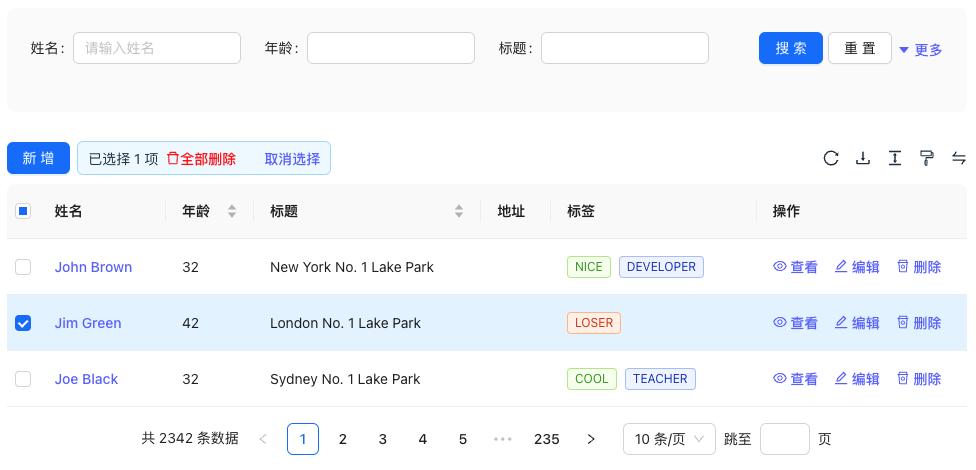

# Antd-Crud

一个基于 React + Ant.Design 的增删改查组件。



### 特征

- 1、极轻量，只依赖于 Ant.Design 再无其他任何依赖
- 2、支持基本的【增删改查】和【批量删除】功能
- 3、支持搜索、自定义分页和自定义排序等功能
- 4、支持刷新、导出 Excel、数据打印、行高设置等功能
- 5、更多的 DIY 配置

### 已完成功能
- [x] 基本增删改查
- [x] 分页加载
- [x] 搜索面板
- [x] 搜索面板自动收缩
- [x] 批量删除
- [x] 数据刷新
- [x] EXCEL 导出
- [x] 行高设置
- [x] 打印功能
- [x] 编辑或查看页面可选 Modal 或者 Drawer
- [x] 编辑页面和查看页面分组设置
- [x] 编辑页面自定义布局

### 待完善功能

- [ ] 列设置功能  
- [ ] 查看页面数据化（非表单形式展示）
- [ ] 编辑和列表在同一个页面的布局选择

### 开始使用

```shell
npm i @codeflex/antd-crud
```

```tsx
function App() {

    const columns: ColumnsConfig<Account> = [
        {
            title: '姓名',
            dataIndex: 'name',
            key: 'name',
            placeholder:"请输入姓名",
            supportSearch:true,
            render: (text) => <a>{text}</a>,
        },
        {
            title: '年龄',
            dataIndex: 'age',
            key: 'age',
            supportSearch:true,
        },
        {
            title: '地址',
            dataIndex: 'address',
            key: 'address',
            supportSearch:true,
        },
        {
            title: '标签',
            key: 'tags',
            dataIndex: 'tags',
            supportSearch:true,
            render: (_, { tags }) => (
                <>
                    {tags.map((tag) => {
                        let color = tag.length > 5 ? 'geekblue' : 'green';
                        if (tag === 'loser') {
                            color = 'volcano';
                        }
                        return (
                            <Tag color={color} key={tag}>
                                {tag.toUpperCase()}
                            </Tag>
                        );
                    })}
                </>
            ),
        }
    ];


    const data: Account[] = [
        {
            key: '1',
            name: 'John Brown',
            age: 32,
            address: 'New York No. 1 Lake Park',
            tags: ['nice', 'developer'],
        },
        {
            key: '2',
            name: 'Jim Green',
            age: 42,
            address: 'London No. 1 Lake Park',
            tags: ['loser'],
        },
        {
            key: '3',
            name: 'Joe Black',
            age: 32,
            address: 'Sydney No. 1 Lake Park',
            tags: ['cool', 'teacher'],
        },
    ];

    const actions:Actions<Account> = {
        onCreate:(account)=>{
            console.log("onCreate", account);
        }
    };


    return (
        <div style={{width:"960px"}}>
            <AntdCrud columns={columns}
                      dataSource={data}
                      actions={actions}
                      pageNumber={1}
                      pageSize={10}
                      totalRow={2342}/>
        </div>
    )
}
```

#### `ColumnConfig` 类型说明：

> `ColumnConfig` 继承了 Antd 的 Table 的 Column 的所有配置，参考：https://ant-design.antgroup.com/components/table-cn#column

在此基础上，增加了自己的配置：

* **placeholder**: 搜索框和编辑页面的占位内容
* **supportSearch**: 是否支持搜素
* **colSpan**: 占位长度，默认值为 20
* **colOffset**: offset 默认值为 2
* **groupKey**: 分组的 key
* **form**: 编辑表单的 form 设置，类型为 `FormConfig`


#### `ColumnGroup` 类型说明：

用于在新增、编辑和查看页面，分组显示 form 内容。

```ts
export type ColumnGroup = {
    key: string,
    title: string,
}
```


#### `FormConfig` 类型说明：

```ts
type FormConfig = {
    
    // 表单类型，默认为 Input，
    // 支持：Input、InputNumber、Hidden、Radio、Checkbox、Rate、
    // Switch、DatePicker、Select、Slider、Upload
    type: string,
    
    //自定义属性，支持 antd 控件的所有属性配置
    attrs?: any,

    //验证规则，只在编辑页面起作用
    rules?: any[],
}
```


#### `Actions` 类型说明：

> `Actions` 是用于定义 AntdCrud 组件的监听方法

`Actions`  定义的类型如下：

```ts
type Actions<T> = {
    //获取数据列表
    onFetchList?: (currentPage: number
        , pageSize: number
        , totalPage: number
        , searchParams: any
        , sortKey: string
        , sortType: "asc" | "desc") => void,

    //获取数据详情
    onFetchDetail?: (row: T) => T,

    //删除单条数据
    onDelete?: (row: T) => void,

    //批量删除数据
    onDeleteBatch?: (rows: T[]) => void,

    //数据更新
    onUpdate?: (row: T) => void,

    //数据创建
    onCreate?: (row: T) => void,

    //初始化搜索框的值
    onSearchValueInit?:(key:string) => any
}
```

需要用户在 `Actions` 定义以上方法，用于对数据进行操作或查询。

### 运行演示

```shell
git clone https://gitee.com/antdadmin/antd-crud.git
cd antd-crud

npm install
npm run dev
```

### AntdAdmin 技术交流群

QQ群：560291578

> **简介：**
> 
> AntdAdmin 是一个以 React + Ant.Design 为基础的开源技术社群，其开源（或计划开源）的高级组件有：
> 
> - antd-crud：一个基于  React + Ant.Design 的增删改查高级组件（已开源）。
> - antd-bpmn：一个基于  React + Ant.Design 的工作流设计组件（准备中...）。
> - antd-builder：一个基于  React + Ant.Design 的拖拽设计组件（准备中...）。